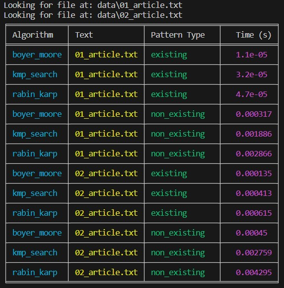

# woolf-algo-hw-05

# Висновки щодо ефективності алгоритмів пошуку підрядка
На основі виконаних вимірювань часу для трьох алгоритмів пошуку підрядка: Боєра-Мура, Кнута-Морріса-Пратта та Рабіна-Карпа, було визначено найшвидший алгоритм для кожного з двох текстів та зроблено загальні висновки.

# Результати
### Для тексту 01_article.txt:
- Найшвидший алгоритм для існуючого підрядка: boyer_moore (1.1e-05 с)
- Найшвидший алгоритм для неіснуючого підрядка: boyer_moore (0.000317 с)

### Для тексту 02_article.txt:
- Найшвидший алгоритм для існуючого підрядка: boyer_moore (0.000135 с)
- Найшвидший алгоритм для неіснуючого підрядка: boyer_moore (0.000743 с)

### В цілому:
- Найшвидший алгоритм для обох текстів: boyer_moore

# Таблиця результатів

# Висновки
На основі результатів, алгоритм boyer_moore показав найкращу продуктивність для обох текстів у випадку пошуку як існуючого, так і неіснуючого підрядка.

### Причини таких результатів:
- Боєра-Мура: Алгоритм використовує ефективну техніку зсуву, що дозволяє пропускати великі частини тексту, особливо корисно для довгих підрядків.

- Кнута-Морріса-Пратта: Алгоритм будує префіксну функцію, що дозволяє уникати повторного порівняння символів, але не має настільки ефективної техніки зсуву, як Боєра-Мура.

- Рабіна-Карпа: Використовує хешування для порівняння підрядків, але для великих текстів і підрядків має більший час виконання порівняно з Боєра-Мура через можливі колізії хешів.

Ці результати можуть змінюватися залежно від характеру тексту та довжини підрядка, тому для кожного конкретного завдання важливо обирати відповідний алгоритм пошуку.